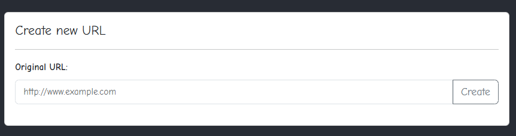
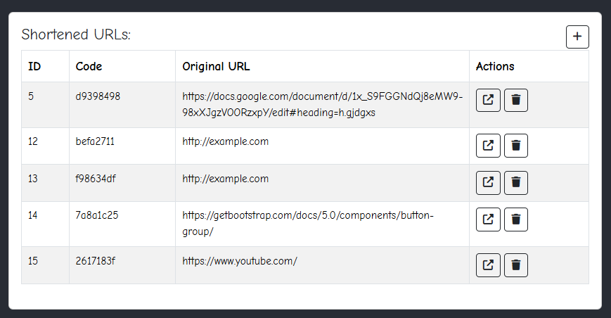
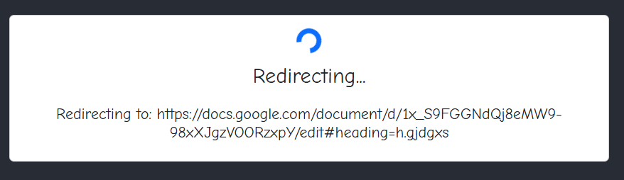

# React URL Shortener Frontend

This is the frontend for the URL shortener application built with React. It communicates with the backend API to create and retrieve short URLs.

## Prerequisites

Before you begin, ensure you have the following installed:

- [Node.js](https://nodejs.org/en/) (v14.x or higher)
- [npm](https://www.npmjs.com/) (npm comes bundled with Node.js)

## Installation

Follow these steps to get the project up and running on your local machine:

1. **Clone the repository:**

   ```bash
   git clone https://github.com/Al88/URLShortenerFront.git
   ```

2. **Install dependencies:**

   Use npm to install the required dependencies for the project.

   ```bash
   npm install
   ```

## Running the Application

To start the development server and see the app in action, run the following command:

```bash
npm start
```

The app will start on [http://localhost:3000](http://localhost:3000). Open this URL in your browser to view the app.

## Features

- Create short URLs by entering the original URL.

- View a list of all previously created short URLs.

- Access the original URL using the short code.


## API Documentation

The frontend interacts with a backend API. Here is the [Swagger documentation](http://localhost:8000/api/documentation) for the backend API.


## Build the Application

To build the application for production, run:

```bash
npm run build
```
This will create a `build` directory with the optimized production build. You can serve it using any static file server.


To build the application for Development, run:

```bash
npm start
```


## License

This project is licensed under the MIT License - see the [LICENSE](LICENSE) file for details.
